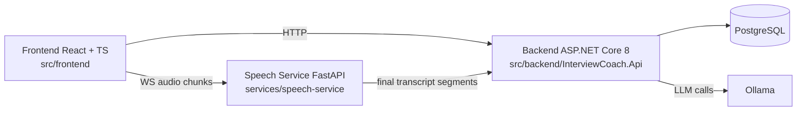

# AI Interview Coach

AI Interview Coach is a full-stack platform for running interview sessions, collecting realtime/offline signals, and generating structured coaching reports.

## What It Does
- Runs interview sessions with configurable role and language.
- Ingests realtime metric events (vision/audio/ASR/LLM) into a durable event timeline.
- Ingests transcript segments with idempotency and merge/normalization logic.
- Finalizes a session into scorecard + pattern feedback.
- Builds deterministic evidence summaries for downstream coaching.
- Generates optional LLM coaching JSON and stores it back as a session event.
- Exports/imports sessions for replay and debugging QA pipelines.

## Quickstart (Docker Compose)
1. Create env file:
   - Linux/macOS: `cp docker/.env.example docker/.env`
   - Windows PowerShell: `Copy-Item docker/.env.example docker/.env`
2. Start everything:
   - `docker compose -f docker/docker-compose.yml up --build`
3. Open:
   - Frontend: `http://localhost:5173`
   - Backend API: `http://localhost:8080`
   - Swagger (Development): `http://localhost:8080/swagger`

Services started by compose:
- `postgres`
- `api` (ASP.NET Core)
- `frontend` (React build served by nginx)
- `ollama` (optional runtime dependency for LLM endpoint)
- `speech-service` (optional runtime dependency for streaming ASR)

## Quickstart (Dev Mode)

### Backend (`src/backend`)
```bash
dotnet restore src/backend/InterviewCoach.sln
dotnet run --project src/backend/InterviewCoach.Api
```

### Frontend (`src/frontend`)
```bash
cd src/frontend
npm ci
npm run dev
```

Frontend default URL: `http://localhost:5173`

## Standard Repo Scripts
If you prefer one command wrappers, use `scripts/`:
- Start stack:
  - PowerShell: `./scripts/start.ps1`
  - Bash: `./scripts/start.sh`
- Test:
  - PowerShell: `./scripts/test.ps1`
  - Bash: `./scripts/test.sh`
- Format/Lint:
  - PowerShell: `./scripts/format.ps1`
  - Bash: `./scripts/format.sh`

## System Overview



## Core Data Flow
1. Vision/audio/asr client signals -> `POST /api/sessions/{id}/events/batch` -> stored as `MetricEvents`.
2. ASR transcript segments -> `POST /api/sessions/{id}/transcript/batch` -> stored/merged as `TranscriptSegments`.
3. Session finalize -> `POST /api/sessions/{id}/finalize` -> writes `ScoreCard` + `FeedbackItems` and returns `derivedFeatureCount` field.
4. Evidence aggregation -> `GET /api/sessions/{id}/evidence-summary` -> deterministic summary JSON.
5. LLM coaching -> `POST /api/sessions/{id}/llm/coach` -> validated coaching JSON, persisted as `MetricEvent` (`type=llm_coaching_v1`).
6. Final read model -> `GET /api/reports/{id}` -> aggregate report DTO.
7. Replay debugging -> export/import/run endpoints to reproduce session state deterministically.

## Environment Variables

### Docker Compose (`docker/.env`)

| Variable | Default | Purpose |
|---|---:|---|
| `POSTGRES_USER` | `coach` | Postgres username |
| `POSTGRES_PASSWORD` | `coachpass` | Postgres password |
| `POSTGRES_DB` | `interviewcoach` | Postgres database name |
| `POSTGRES_PORT` | `5432` | Host port mapped to postgres |
| `API_PORT` | `8080` | Host port for backend API |
| `FRONTEND_PORT` | `5173` | Host port for frontend |
| `FRONTEND_ORIGIN` | `http://localhost:5173` | CORS allowed origin for backend |
| `VITE_API_URL` | `http://localhost:8080/api` | Frontend API base URL (build arg) |
| `VITE_SPEECH_URL` | `http://localhost:8000` | Frontend speech-service base URL (build arg) |
| `OLLAMA_PORT` | `11434` | Host port for Ollama |
| `LLM_MODEL` | `qwen2.5:7b-instruct` | Ollama model name used by backend |
| `LLM_TIMEOUT_SECONDS` | `60` | Backend LLM HTTP timeout |
| `SPEECH_PORT` | `8000` | Host port for speech-service |
| `SPEECH_MODEL` | `small` | Speech-service model selector |

## API Highlights
- `GET /health`: liveness check.
- `GET /health/ready`: readiness check (includes DB connectivity).
- `POST /api/sessions`: create session.
- `POST /api/sessions/{sessionId}/events/batch`: metric event ingestion (idempotent by `clientEventId`).
- `POST /api/sessions/{sessionId}/transcript/batch`: transcript ingestion + merge (idempotent by `clientSegmentId`).
- `POST /api/sessions/{sessionId}/finalize`: compute and persist final score/pattern output.
- `GET /api/reports/{sessionId}`: aggregate report read endpoint.
- `GET /api/sessions/{sessionId}/evidence-summary`: deterministic compact summary.
- `POST /api/sessions/{sessionId}/llm/coach?force=false|true`: return cached or regenerate coaching JSON.
- `GET /api/sessions/{sessionId}/replay/export`: export session replay payload.
- `POST /api/sessions/replay/import`: import replay payload into a new session.
- `POST /api/sessions/{sessionId}/replay/run`: run finalize on imported session.

## Troubleshooting
- Port already in use:
  - Change mapped ports in `docker/.env` (`API_PORT`, `FRONTEND_PORT`, `POSTGRES_PORT`, `OLLAMA_PORT`, `SPEECH_PORT`).
- CORS blocked in browser:
  - Ensure `FRONTEND_ORIGIN` matches the URL you open in browser.
- DB migration/startup issues:
  - API applies migrations at startup. Ensure postgres is healthy first:
    - `docker compose -f docker/docker-compose.yml ps`
    - `docker compose -f docker/docker-compose.yml logs api`
- Ollama model missing:
  - Pull model in running container:
    - `docker compose -f docker/docker-compose.yml exec ollama ollama pull qwen2.5:7b-instruct`
- Speech service unavailable:
  - Check health/logs:
    - `docker compose -f docker/docker-compose.yml ps`
    - `docker compose -f docker/docker-compose.yml logs speech-service`
  - GPU olmayan makinelerde `SPEECH_COMPUTE_TYPE=int8` ve `SPEECH_DEVICE=cpu` kullanin. `float16` speech modelinin hazir olmasini engelleyebilir.

## More Details
- Architecture and payload examples: `docs/ARCHITECTURE.md`
- Privacy notes: `docs/privacy.md`
